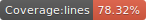

# Javascript functional kit

Composition laws :

y => whatever(y)  == whatever

naming: 

    - key : 

        {
            key: value
        }

    - prop : 
        o = {
            key: value
        }

        prop = o[key]
        